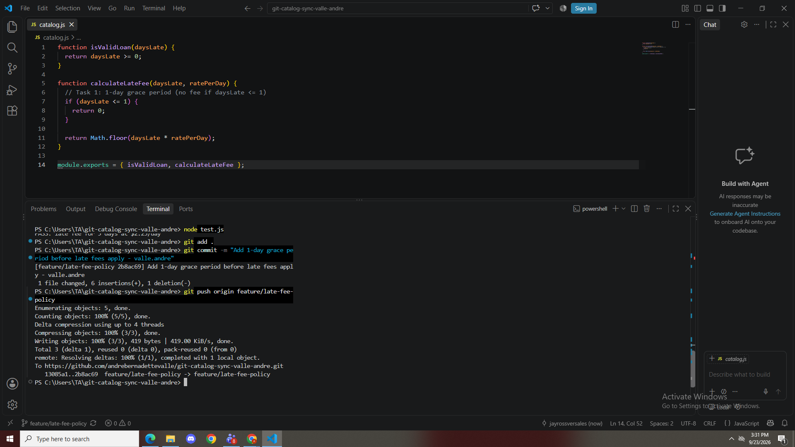
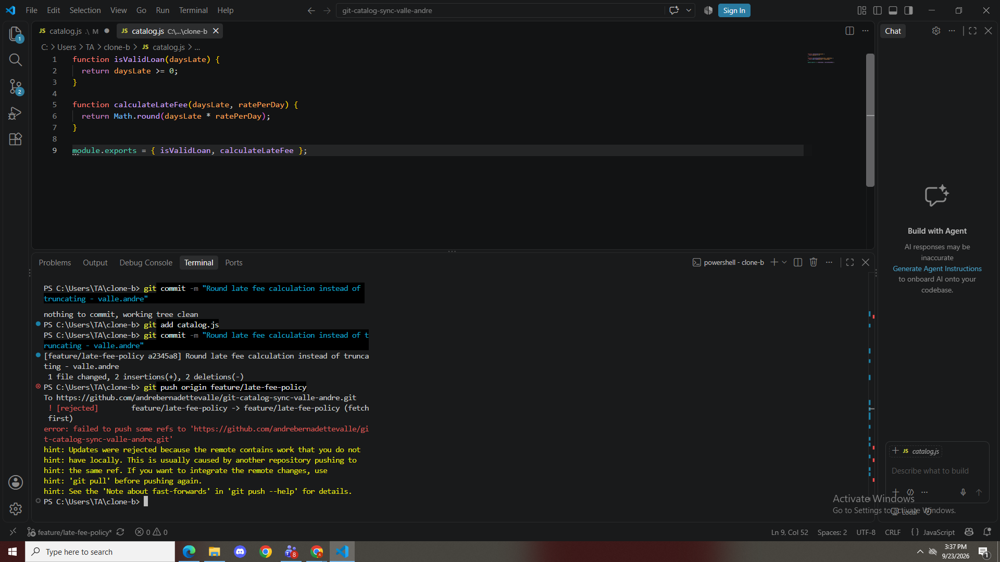
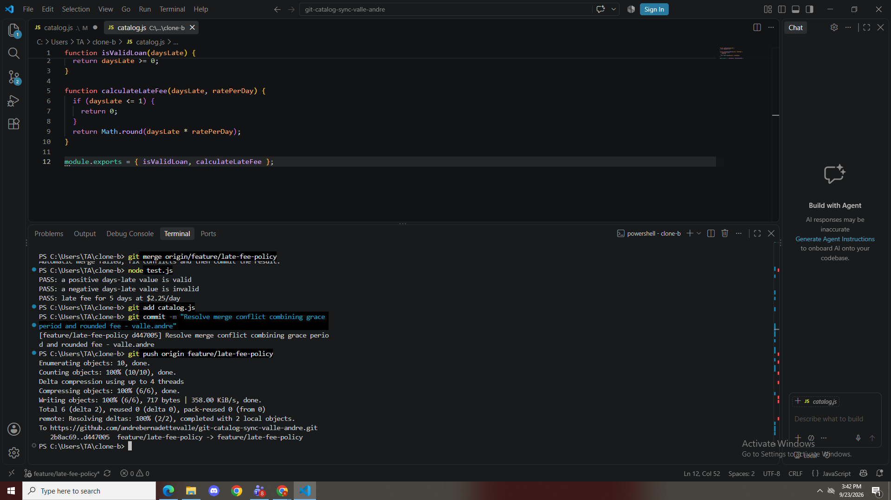
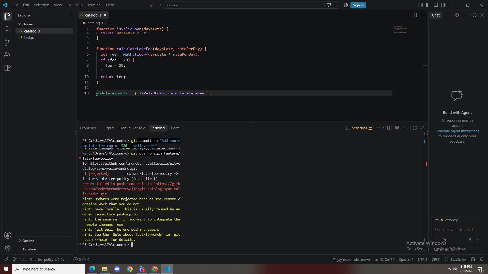
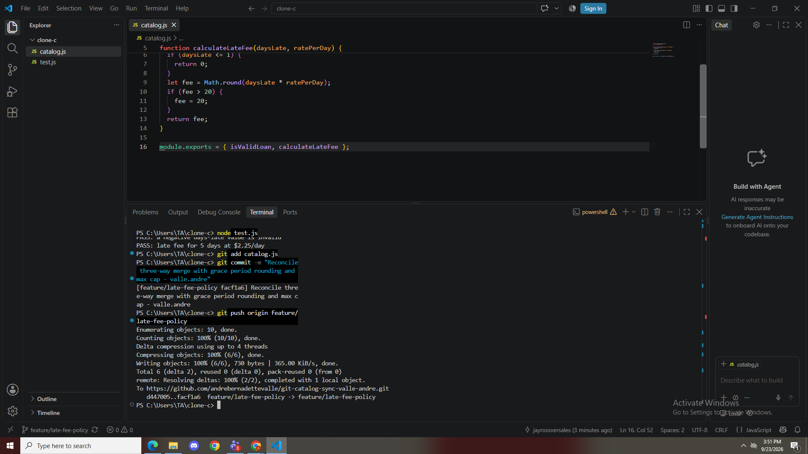
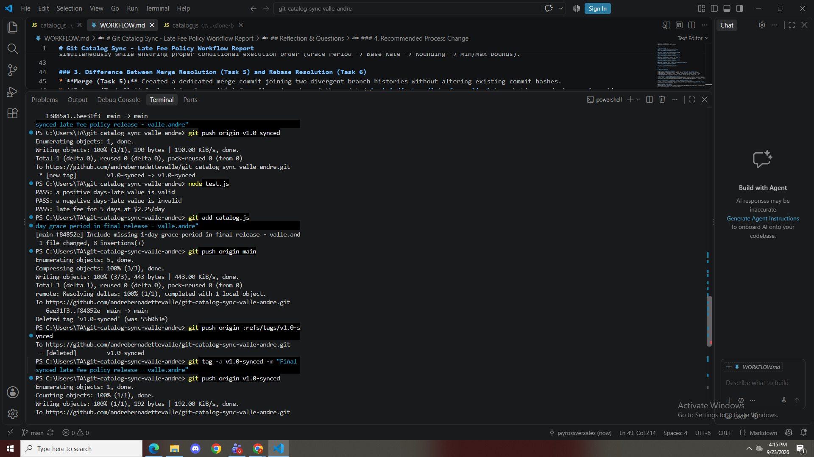

# Git Catalog Sync - Late Fee Policy Workflow Report

**Author:** Andre Bernadette Valle  
**Repository:** git-catalog-sync-valle-andre  

---

## Task Screenshots

### Task 1: Grace Period Commit & Push (Clone A)

### Task 2: Rounding Commit & Rejected Push (Clone B)

### Task 3: 2-Way Merge Conflict Resolution (Clone B)

### Task 4: Max Cap Commit & Rejected Push (Clone C)

### Task 5: 3-Way Merge Conflict Resolution (Clone C)

### Task 6: Minimum Fee Commit & Rebase Conflict Resolution (Clone A)

### Task 7: Merge into Main and Tag v1.0-synced

---

## Reflection & Questions

### 1. Final `calculateLateFee` Breakdown
* **Grace Period (1 Day):** Contributor 1 (Clone A, Task 1). Returns `0` when `daysLate <= 1`.
* **Fee Rounding:** Contributor 2 (Clone B, Task 2). Applies `Math.round` to calculated late fees.
* **$1 Minimum Fee:** Contributor 1 (Clone A, Task 6). Bumps any non-zero late fee below $1 up to $1.
* **$20 Maximum Fee Cap:** Contributor 3 (Clone C, Task 4). Caps any late fee exceeding $20 to $20.

### 2. Two-Way vs. Three-Way Merge Conflict Analysis
In Task 3 (2-way conflict), only two sets of logic collided (grace period vs. rounding), requiring a single direct reconciliation. In Task 5 (3-way conflict), Clone C had fallen behind both Task 1 and Task 2 commits. Reconciling required integrating three distinct business logic requirements simultaneously while ensuring proper conditional execution order (Grace Period -> Base Rate -> Rounding -> Min/Max bounds).

### 3. Difference Between Merge Resolution (Task 5) and Rebase Resolution (Task 6)
* **Merge (Task 5):** Created a dedicated merge commit joining two divergent branch histories without altering existing commit hashes.
* **Rebase (Task 6):** Replayed local commit(s) from Clone A on top of the updated `origin/feature/late-fee-policy` branch tip, producing a clean linear commit history without an extra merge commit.

### 4. Recommended Process Change
Implementing a **Pull Request (PR) review workflow on GitHub combined with short-lived feature branches** and requiring developers to run `git pull --rebase` before pushing would prevent all three rejected pushes.